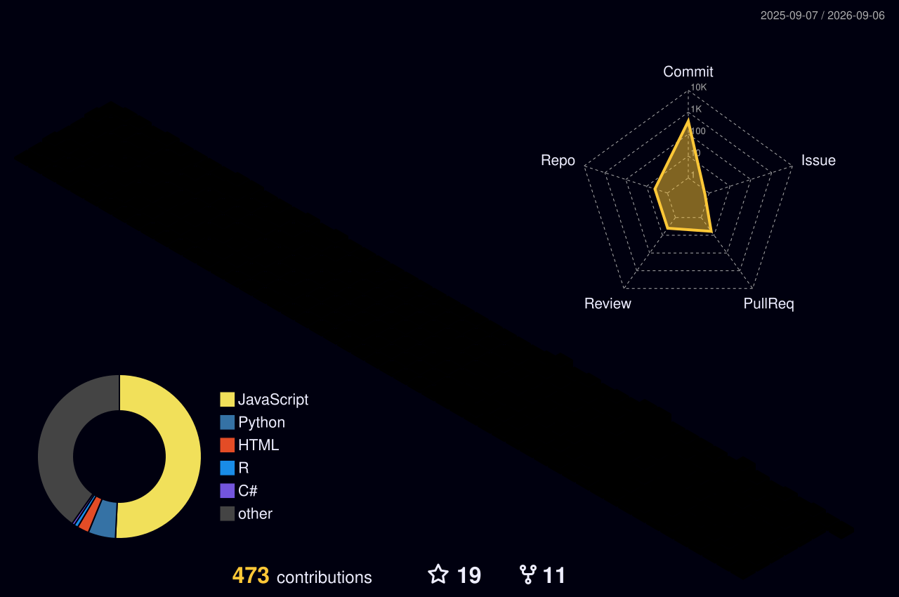

# I'm Pride

I'm a computational biomedicine student studying research bioinformatics, biomedical informatics and computational biology. 
I am involved in a wide array of omics (genomics, metagenomics, metabolomics, proteomics), evolutionary biology, and neurobiology.
I have participated in and coauthored federally sponsored research; developing computational models to analyze metatranscriptomic data, 
predictive analytics in cladistics, phylogeny and plant taxonomy, 
and identifying responsive metabolic composites offsetting ecological growth of the endangered and largest plant species in the world.

You might find me watching a lot of films because that's probably where I would've ended up if I hadn't touched a computer. That is Oscar Isaac on my profile picture. 
> ***In Oscar Isaac we trust.***

Developer for [@ProjectKorra](https://github.com/ProjectKorra).

##

  

##

##

  

<!--  -->
