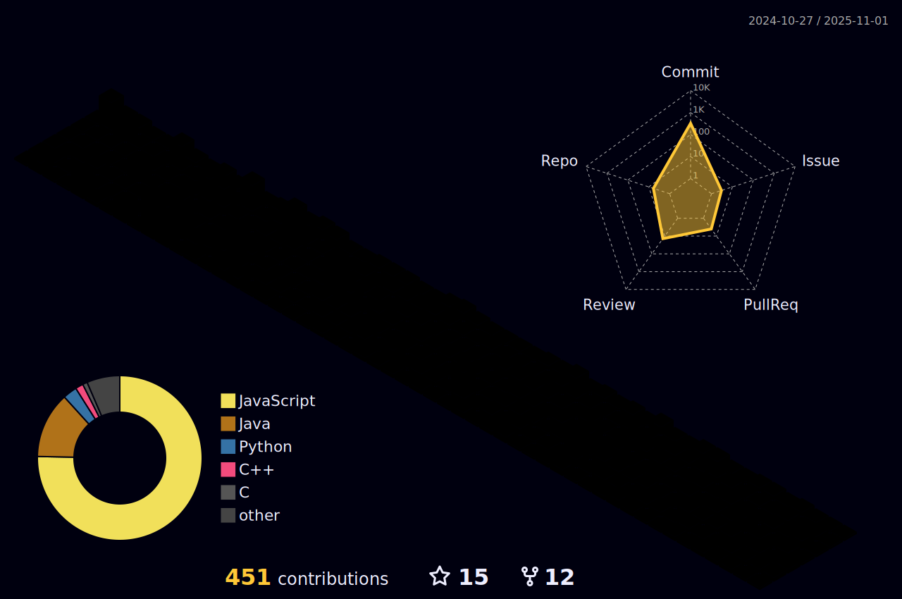

# I'm Pride

I'm a computer and data science and biology student studying software development and computational biology/bioinformatics, as well as working in research on developing a predictive machine learning model
based on LLM image classification to predict plant genera. I also get involved in omics (genomics, metagenomics, metabolomics, proteomics), evolutionary biology, botany, and ecological and atmospheric sciences.
Secretly (not really), I have a better hand at software and full stack development.

I'm otherwise writing screenplay and doing filmmaking stuff, stargazing, storm watching, cooking, watching movies or sleeping.

You might find me watching a lot of films because that's probably where I would've ended up if I hadn't touched a computer. That is Oscar Isaac on my profile picture. 
> ***In Oscar Isaac we trust.***

Developer for [@ProjectKorra](https://github.com/ProjectKorra).

##

  
  <h6 align="right">MARTY SUPREME (2025)</h6>

##

  

##

##

  

<!--  -->
